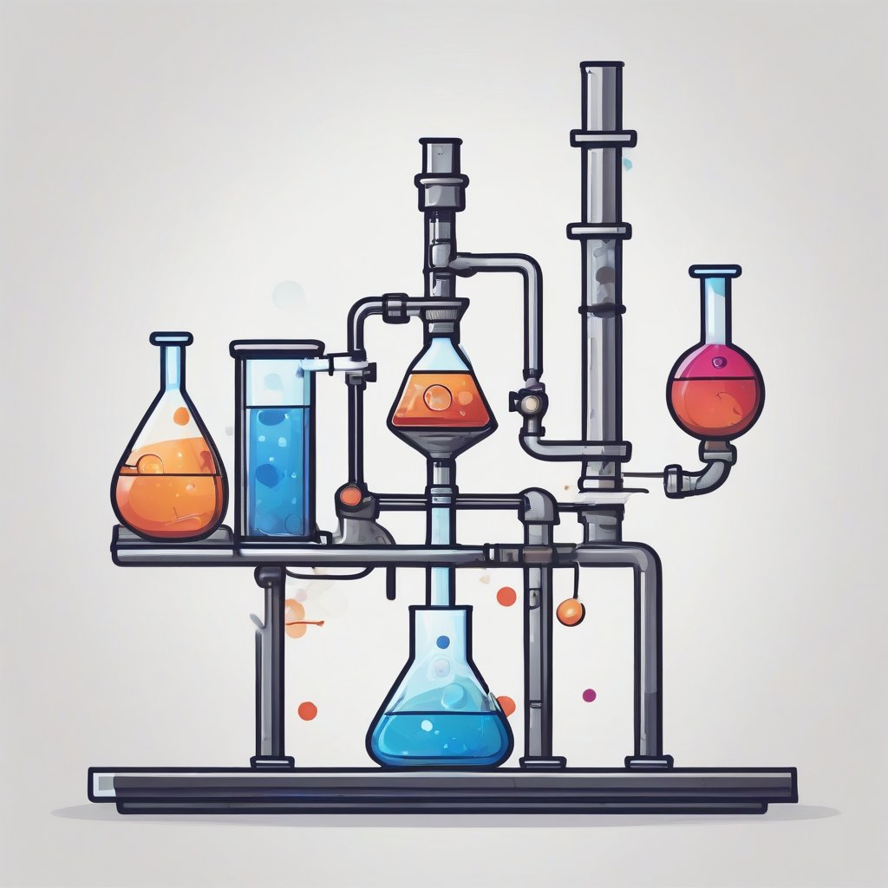

# context_distillation

Framework to achieve context distillation in LLMs
# Introduction
Context Distillation is one of the first techniques that were discussed in the research state of the art of language models; in order to perform alignment for the LLMs.
This technique has been one of the main components for proprietary LLMs like Anthropic; in whose research work, they mention context distillation as one of the main techniques to perform model alignment: https://www.anthropic.com/index/a-general-language-assistant-as-a-laboratory-for-alignment

At DaertML, we could not find any open source frameworks to perform context distillation; so we created our own, here it is as a WIP (Work In Progress) project that you can extend and use for your projects.

Context Distillation does not have to do only with safety in the LLM realm, it is also a technique to align the model in any other area apart from safety and censorship of the model capabilities. We believe this technique is a great way of making a model to learn about a certain output format for the generation. In addition, context distillation is a foundation to teach a model how to do a reasoning task without it needing to generate a step by step reproduction of the steps that it would follow.

# Getting started
In order to use the framework, first there is a phase for synthetic Data generation; which will serve the training materials for the model. Synthetic Data Generation used in conjunction with Context Distillation can provide a powerful framework for model fine tuning as well.

In order to generate data, we provide the data_gen.py script. We expect the user to have running a llama.cpp API server on localhost:8080; in case there is none, the user can modify this script to generate data with a model using other frameworks.
This is an example execution:
python3 data_gen.py nous-hermes-llama2-13b.Q4_K_S.gguf ./prompts/distill.json

In this case the first parameter is the model file (not used, as we expect the script to have a LLaMA.cpp server runing; but left for future development and support for no server).
The first parameter is the name of the model and the second the JSON file with the prompts for the model to generate data from. We provide an example of the expected fields for such JSON file in prompts/distill.json.

The synthetic data will be writen to the folder "output". The synthetic data is then used by the distill_llama2.py script to fine tune the model. Even though Context Distillation is meant to be used with the same model that generated the data to distill; or at list a model of the same parameter size, it can be used with any other model or model size.

This is an example on how to use the distillation script:
python3 distill_llama2.py meta-llama/Llama-2-7b ./output/distill.json

The first parameter is the HuggingFace model to distill, and the second is the distillation data file generated by the model with the synthetic data. (the data_gen script outputs the data to "./output" folder)
We provide two scripts to test the distilled model: gpu_inference.py and cpu_inference.py. Both use the same parameters to test the model with a new prompt.
This is an example on how to run this command:
python3 gpu_inference.py ./results/arith/final_merged_checkpoint/ ./demo.txt

In this case the first parameter is the model to be used and the second is the file that contains the prompt to test the model. (We do not provide terminal based input for the prompt due to lack of time; we are so busy doing e/acc, terminal input can wait:)).

